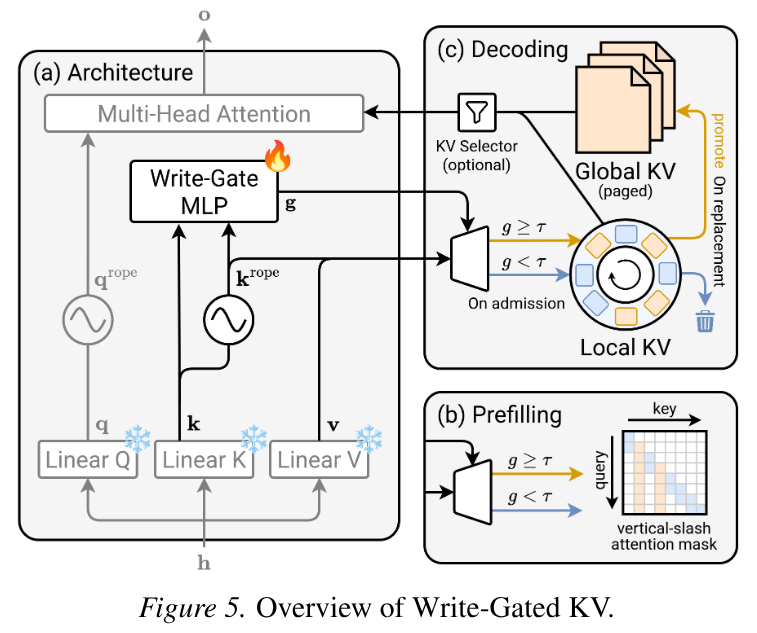
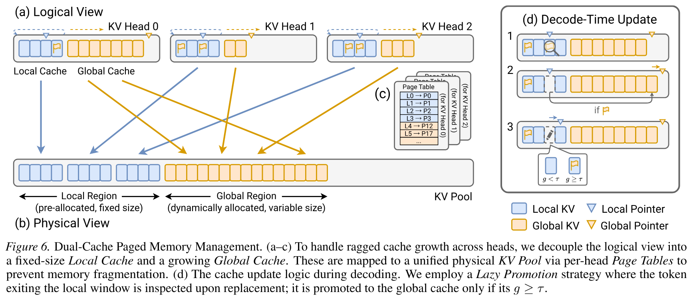
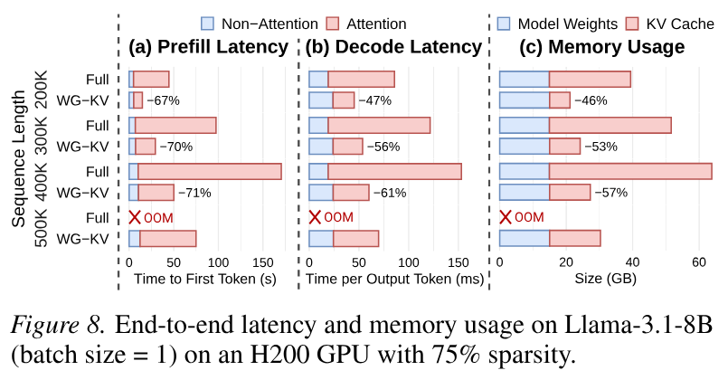
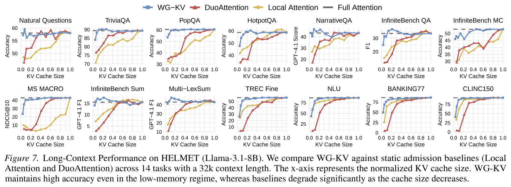
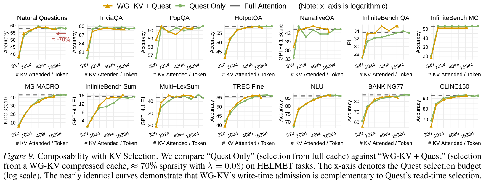
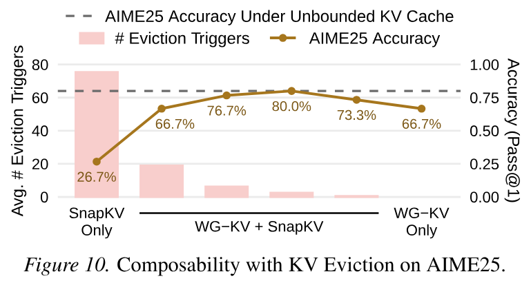

[](https://arxiv.org/abs/2512.17452)
[](LICENSE)

This repository contains the official implementation of the paper **"KV Admission: Learning What to Write for Efficient Long-Context Inference"**.

## 📖 Abstract

Long-context LLM inference is bottlenecked by the quadratic attention complexity and linear KV cache growth. Prior approaches (KV Selection or Eviction) mitigate this post-hoc, but overlook the root inefficiency: indiscriminate writing to memory.

We propose **Write-Gated KV (WG-KV)** to introduce a missing primitive: **KV Admission**. Instead of blindly persisting every token, WG-KV employs a lightweight, learnable mechanism to predict token utility before cache entry. By filtering out low-utility states early to maintain a compact global cache alongside a sliding local cache, WG-KV reduces memory usage by **46-68%** and delivers **3.03-3.70x** prefill and **1.85-2.56x** decode speedups. Furthermore, WG-KV seamlessly composes with existing KV Selection and Eviction methods, unlocking compound efficiency gains without significant architectural changes.

<p align="center" width="100%"></p>

## ⚙️ System Architecture

Implementing WG-KV results in **Ragged KV States**, where different attention heads possess significantly different cache lengths. Standard contiguous memory allocation would lead to severe fragmentation. To solve this, we introduce **Dual-Cache Paged Memory Management**:

<p align="center" width="100%"></p>

This design ensures that WG-KV remains compatible with optimized **PagedAttention** kernels, translating theoretical sparsity into actual wall-clock speedups.

## 🛠️ Installation

### 1. Clone the Repository

```bash
git clone --recursive https://github.com/EMCLab-Sinica/WG-KV.git
cd WG-KV
```

### 2. Setup Environment

We use [uv](https://github.com/astral-sh/uv) to manage the virtual environment, handle dependencies, and apply patches to the [🤗 Transformers](https://github.com/huggingface/transformers) library.

```bash
# Prepare Python environment with CUDA support
conda create -n wgkv python=3.12
conda activate wgkv
conda install cuda -c nvidia/label/cuda-12.9.1

# Create and activate virtual environment
uv venv venv
source venv/bin/activate

# Install core dependencies
uv pip install -r requirements.txt

# Apply patches to the Transformers library
bash setup_venv.sh venv
```

### 3. Install Custom vLLM

WG-KV requires a modified version of [vLLM](https://github.com/vllm-project/vllm) to support sparse prefill kernels.

```bash
# Clone our vLLM fork
git clone -b v0.10.0 --no-tags --depth=1 https://github.com/vllm-sparse/vllm.git scripts/third_party/vllm

# Configure build environment
env -C scripts/third_party/vllm python use_existing_torch.py
uv pip install -r scripts/third_party/vllm/requirements/build.txt

# Compile and install (this may take a few minutes)
MAX_JOBS=4 uv pip install --no-build-isolation -e scripts/third_party/vllm
```

## 📦 Model Checkpoints

We provide pre-trained weights for the **Write-Gate MLP**. The checkpoints follow the naming convention `{model_name}-{lambda}.pt`, where `lambda` (λ) controls the trade-off between sparsity and accuracy:

* **Higher λ:** Higher sparsity, retaining less KV cache (Aggressive).
* **Lower λ:** Higher accuracy, retaining more KV cache (Conservative).

You can download them directly from [🤗 our Hugging Face Repository](https://huggingface.co/WG-KV/checkpoints).

```bash
# Install the Hugging Face CLI
uv pip install huggingface_hub

# Download Llama-3.1-8B-Instruct checkpoints
hf download WG-KV/checkpoints --include "llama-3.1-8b-instruct-*.pt" --local-dir weights

# Download Qwen3-4B-Instruct-2507 checkpoints
hf download WG-KV/checkpoints --include "qwen3-4b-instruct-2507-*.pt" --local-dir weights

# Download Qwen3-4B-Thinking-2507 checkpoints
hf download WG-KV/checkpoints --include "qwen3-4b-thinking-2507-*.pt" --local-dir weights
```

## 🚀 Usage

### Training

To train the gate (e.g., for Llama-3.1-8B) with a specific λ (e.g., 0.04):

```bash
python scripts/train.py \
  --model_name meta-llama/Llama-3.1-8B-Instruct \
  --lambda_reg 0.04
```

The trained checkpoints will be saved in the `outputs/` directory.

*See `scripts/train.py` for additional arguments.*

### Inference

To run inference using the trained gate, specify the checkpoint path using `--filtering_path`:

```bash
python scripts/inference.py \
  --model_name meta-llama/Llama-3.1-8B-Instruct \
  --filtering_path weights/llama-3.1-8b-instruct-0.04.pt
```

*See `scripts/inference.py` for additional arguments.*

## 📊 Results

### 1. System Efficiency ⚡

WG-KV significantly accelerates inference while reducing resource consumption. On Llama-3.1-8B with 75% sparsity, it achieves **~3x prefill speedup**, **~2x decode speedup**, and a **~50% reduction in memory usage**.

<details>

<summary>Show commands</summary>

```bash
# Baseline (Full Attention)
python scripts/profiling.py \
  --model_name meta-llama/Llama-3.1-8B-Instruct \
  --profile_attn_mlp \
  --max_tokens_per_head 401000 \
  --prompt_length 400000 \
  --g_expand 0

# WG-KV (75% Sparsity)
python scripts/profiling.py \
  --model_name meta-llama/Llama-3.1-8B-Instruct \
  --profile_attn_mlp \
  --max_tokens_per_head 401000 \
  --prompt_length 400000 \
  --random_sparsity 0.75
```

</details>

<p align="center" width="100%"></p>

### 2. Long-Context Understanding (HELMET) 🧠

Evaluated on the [HELMET](https://github.com/princeton-nlp/HELMET) benchmark, WG-KV outperforms static admission baselines (e.g., Local Attention, DuoAttention) across diverse tasks, maintaining **near-lossless accuracy** even with **<10% KV cache**.

<details>

<summary>Show commands</summary>

```bash
# Clone the repository
git clone -b dev --recursive https://github.com/lashhw/HELMET.git scripts/third_party/HELMET

# Install dependencies
uv pip install -r scripts/third_party/HELMET/requirements.txt
uv pip install flash-attn --no-build-isolation

# Download HELMET datasets
env -C scripts/third_party/HELMET bash scripts/download_data.sh

# Link checkpoints directory
ln -s ../../../weights scripts/third_party/HELMET/weights

# Evaluate Baselines (Full Attention, Local Attention, DuoAttention)
env -C scripts/third_party/HELMET bash run_vanilla_all.sh
env -C scripts/third_party/HELMET bash run_local_all.sh
env -C scripts/third_party/HELMET bash run_duo_all.sh

# Evaluate WG-KV
env -C scripts/third_party/HELMET bash run_filtering_all.sh
```

</details>

<p align="center" width="100%"></p>

Furthermore, WG-KV is **composable** with **Quest (KV Selection)**, enabling compound efficiency gains by filtering noise before selection occurs.

<details>

<summary>Show commands</summary>

```bash
# Evaluate "Quest Only"
env -C scripts/third_party/HELMET bash run_quest_all.sh "320 512 1024 2048 4096 8192"

# Evaluate "WG-KV + Quest"
env -C scripts/third_party/HELMET bash run_fquest_all.sh "0.08" "320 512 1024 2048 4096 8192"
```

</details>

<p align="center" width="100%"></p>

### 3. Complex Reasoning (AIME25) 🧩

WG-KV also excels in reasoning tasks where long thinking traces rapidly consume memory. Under strict memory bounds, relying solely on **SnapKV (KV Eviction)** leads to **catastrophic degradation (26.7% accuracy)**. By pairing it with **WG-KV (KV Admission)** to filter noise early, we **restore accuracy to 80.0%**, matching the unbounded baseline.

<details>

<summary>Show commands</summary>

```bash
# Install lm-evaluation-harness
uv pip install -e scripts/third_party/lm-evaluation-harness

# Evaluate Unbounded KV Cache Baseline
python scripts/eval.py \
  --model_name Qwen/Qwen3-4B-Thinking-2507 \
  --use_baseline

# Evaluate "SnapKV Only"
python scripts/eval.py \
  --model_name Qwen/Qwen3-4B-Thinking-2507 \
  --snapkv_enabled \
  --snapkv_max_cached_tokens 1105920 \
  --snapkv_evict_ratio 0.1 \
  --use_baseline

# Evaluate "WG-KV + SnapKV"
python scripts/eval.py \
  --model_name Qwen/Qwen3-4B-Thinking-2507 \
  --snapkv_enabled \
  --snapkv_max_cached_tokens 1105920 \
  --snapkv_evict_ratio 0.1 \
  --filtering_path weights/qwen3-4b-thinking-2507-0.32.pt
```

</details>

<p align="center" width="100%"></p>

## 📂 Repository Structure

* `scripts/`: Training, inference, and evaluation scripts.
* `src/`: Modified [🤗 Transformers](https://github.com/huggingface/transformers) modules implementing core logic for WG-KV.
* `utils/`: Attention kernel microbenchmarks and testing scripts.

## 📄 Citation

If you find this work useful, please cite our paper:

```bibtex
@misc{wgkv,
   title={KV Admission: Learning What to Write for Efficient Long-Context Inference},
   author={Yen-Chieh Huang and Pi-Cheng Hsiu and Rui Fang and Ming-Syan Chen},
   year={2025},
   eprint={2512.17452},
   archivePrefix={arXiv},
   primaryClass={cs.LG},
   url={https://arxiv.org/abs/2512.17452}, 
}
```
